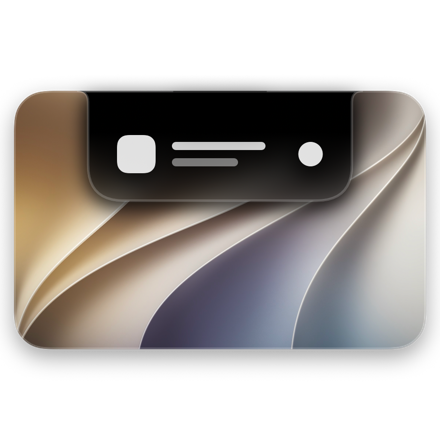

# NotchIsland

Turns the MacBook notch into a Dynamic-Island-style surface made of Liquid Glass.
Rest the pointer on the notch and it grows into a panel; music, timers, battery
events, volume/brightness and dropped files live there the rest of the time.

<p align="center">
  
</p>

<h2 align="center">
  <a href="https://github.com/vdavid0814/notch-island-public/releases/latest/download/NotchIsland.dmg">⬇&nbsp;&nbsp;Download NotchIsland v0.7.2 (.dmg)</a>
</h2>
<p align="center">
  <sub>Latest version · macOS 27 · MacBook with a notch (Apple silicon) · <a href="#download">How to install</a></sub>
</p>

For older versions, see the **[Releases page](https://github.com/vdavid0814/notch-island-public/releases)**.
How much energy each animation and the idle state take, measured before and after the latest energy work:
**[docs/ENERGY-LOG.md](docs/ENERGY-LOG.md)**, and the tests behind it with their results:
**[docs/PERFORMANCE-TESTS.md](docs/PERFORMANCE-TESTS.md)** (both also in the .dmg and inside the app).

Swift 6, SwiftUI, macOS 27.

---

## Since v0.7.2 (not released yet)

- **Settings opens and changes pages without a cost spike**: it is built once a few seconds after
  launch, unseen, and kept (Activity Monitor's Energy Impact for a tour of the pages ~590 → ~41;
  about 110 MB more memory). The widget gallery's pictures come in at once.
- **Siri**: its lists are read ahead and kept, searches run on the efficiency cores (typing a first
  word after launch 377 → 286, the first opening 79 → 71).
- **The panel's pages** slide in from their side of the header as they fade in.
- Details and what is still above target: [docs/ENERGY-LOG.md](docs/ENERGY-LOG.md).

## What's new in v0.7.2

Customize rebuilt from the ground up, more of every widget to style, and a battery page laid out
like the iPhone's Battery Usage.

- **Resizing and dragging, from scratch**: an element's outline is exactly its frame. Keep Shape
  on gives four corner handles and scales it as a whole; off gives eight. Text keeps its own size:
  wider fits more words, taller adds lines (or, switched off, grows the letters), narrower cuts the
  text or shrinks it (Too Long: Cut / Shrink) without changing its height. Nothing limits how large
  an element gets or where it goes.
- **Inspector**: Layer (In Front / Behind, offered only where elements overlap), Frame and Keep
  Shape, Text (wording, most lines, too long, lines when taller, alignment), Font (style with
  italic, weight, size, colour). The rarer settings are out for now.
- **Buttons**: shape, corners, material (Glass, Tinted Glass, Solid, Outline, None), button colour
  and icon colour — previous and next included. **Bars**: the shape of their ends and a knob where
  the fill ends (circle, pill, square, line) in a colour of its own; the times under Now Playing's
  line take a colour too. **Pictures**: corners, border, shadow, colour strength, opacity.
- **Now Playing**: Back and Forward by seconds (off until switched on; the seconds set on each).
  Size L runs the cover out to the widget's edges; previous/next and the progress bar have S, M, L
  of their own. The row of buttons makes room for what is switched on and never runs out of the
  widget.
- **Behaviour** says what each setting does and when; Only Active and Dim Inactive appear only
  where a widget has an idle state.
- **Battery page, like the iPhone's Battery Usage**: the chart in hourly bars (grey, green while
  charging under a cap, red when low); new widgets **Daily Usage** (the last eight days, a click
  picks a day for the chart too, with the iPhone's "more / less than usual" sentence), **Screen
  Activity** (the displays on and off that day) and **Last Charge**. The page is laid out anew once
  (the old one kept aside).
- Fixes: the Elements list's symbols on the white theme; Daily Usage on a low widget.

## What's new in v0.7.1

The same island for far less of the window server's work: what NotchIsland costs macOS to draw,
not only what it costs itself. Everything looks and moves as before, apart from Settings' plain
background.

- **Settings**: touring the pages takes about two thirds less of the window server (13.1 → 4.3 J);
  General left open went from 0.8 W to 0.02 W (its animation picture now plays only when it moves
  and while it is in view).
- **Opening the island**: 10 opens and closes 7.8 → 4.4 J in the window server; the open panel on
  a playing track about half (its progress line now really steps twice a second).
- **At rest with music**: 17.7 → 14.5 mW (the fade's soft black is drawn once, not blurred again
  for every frame of the bars).
- **Settings' background and sidebar are a plain material** instead of glass, in the same greys;
  the segmented bars and buttons keep their glass.
- How it was measured (the app, the window server and coreaudiod together, with a real pointer):
  [docs/ENERGY-LOG.md](docs/ENERGY-LOG.md), [docs/PERFORMANCE-TESTS.md](docs/PERFORMANCE-TESTS.md)
  and `Scripts/perf/ws/ws_bench.py`; the method, for the next round:
  [docs/OPTIMIZATION-PLAYBOOK.md](docs/OPTIMIZATION-PLAYBOOK.md).

## What's new in v0.7

Every widget is editable down to its parts, the top bar is yours to arrange, a window can be held
under the notch, and Spotlight reaches people, events and words.

- **Customize a widget**: Settings ▸ Widgets ▸ Customize (or right-click a widget ▸ Customize). The
  widget grows out of its place on the stage into a one-widget editor: an outline of its parts, an
  inspector for the widget and for each part (show or hide, size, weight, colour, alignment,
  corner), and the widget itself on a canvas. Unlock the layout and every part becomes a frame you
  move and resize on a grid, with guides, align and distribute, spacing, flip, duplicate, decorations
  and a density control; what no longer fits waits in a "Didn't fit" tray. Everything is undoable
  and a widget without changes looks exactly as before.
- **57 widget kinds** (26 new): readings of the battery (time, health, cycles, power, temperature,
  charger, a chart), controls (sound output, mute, True Tone, Stage Manager, Low Power Mode, Screen
  Mirroring, Mission Control, Show Desktop, Apps, Character Viewer, Display Sleep), time (world
  clocks, an analog clock, a month calendar, Up Next from Calendar, a countdown), system (network
  speed, disk space, uptime, AirPods battery) and tools (a Shortcut, an app launcher, the clipboard,
  a photo frame).
- **Top bar and size**: Settings ▸ Widgets ▸ Top Bar arranges the bar beside the pages: which items
  (clock, now playing, toggles, screenshot, lock, release window…), on which side, in which order;
  items that do not fit go into an overflow menu. Size changes the panel's size and the widget grid
  by dragging its handles, and widgets that no longer fit park safely.
- **Size by cells**: Settings ▸ Widgets ▸ Size now works in cells. Add columns (one at each side at
  once) or rows (at the bottom) and every widget keeps its cells and its place about the notch, so
  more cells are simply more room. The cells keep their size and the panel grows with them, or
  turn on Keep Panel Size and the cells and the gap get smaller instead. Cell width, height and gap
  have their own sliders; the most used controls sit right under the stage.
- **Moving and resizing parts** of a customized widget lands exactly where the outline showed and
  comes back exactly when dragged back (checked on ten widgets, every part, every handle). A
  part's S, M, L size in Settings ▸ Widgets now works in a customized layout too: it scales the
  part's frame about its middle.
- **Window Anchor**: hold another app's window centred under the notch. "Anchor Front Window" in the
  menu bar item or Spotlight (⌘5, or ⌘↩ on a window in ⌘6), `notchisland://anchor/front`, or drag a
  window to the notch: the island shows where it will land. It stays put (moved, it goes back;
  resized, it stays centred at its new size), is let go when you drag it away, zoom it or close it,
  and remembers its size per app. With "Live copy when covered" a live picture floats above the
  windows that cover it (asks for Screen Recording the first time; click it to bring the real
  window forward). Needs Accessibility; each part can be switched off under Settings ▸ Live Activities ▸
  Window Anchor.
- **Spotlight**: ⌘8 People & Calendar (contacts: call, message, email, copy; your coming events), a
  word's definition from the system dictionaries, bookmarks from Safari, Chrome, Arc and Brave,
  content search and more folders for files, Quick Look with Space or ⌘Y, Reveal in Finder with ⌘R,
  time zones ("time in Tokyo", "15:00 London in Budapest"), date maths ("30 days from now"), more
  units and, if you turn it on, currencies (the European Central Bank's daily rates; what you type
  is never sent).

## What's new in v0.6

A battery page, a Spotlight that reaches the whole Mac, widgets you can have more than once, and
another energy round.

- **Battery page**: a fourth page in the open island (on Macs with a battery). Click the battery at
  the top, or pick it beside Home, Timer and Shelf. The level, how long until full or empty, the
  battery's maximum capacity and cycle count, the charger's watts, and an iPhone-style chart of
  today with charging, sleep and display-off times ("Last charged to 100 % at 7:40"). The history
  of the last 8 days stays on the Mac and is recorded without waking it. Chart style (bars, area,
  line), range (today, 24 h, 48 h), colours and captions: Settings ▸ Live Activities ▸ Battery
  Page, or right-click the chart.
- **Spotlight reaches more**:
  - **⌘5 System**: the island's own commands (its pages, Settings panes, keep open, edit a widget),
    Control Center switches (Wi-Fi, Bluetooth, Dark Mode, Night Shift, Focus…), about 65 System
    Settings panes by name or synonym, and Lock Screen, Sleep, Turn Display Off, Screen Saver, Show
    Desktop, Mission Control, Restart, Shut Down, Log Out and Empty Trash (asks first).
  - **⌘6 Windows**: running apps and their windows; Return switches, ⌘H hides, ⌘Q quits.
  - **⌘7 Emoji**: find an emoji by name; Return pastes it, ⌘C copies it.
- **Widgets**:
  - The same widget more than once, each with its own settings: right-click a widget ▸
    Duplicate.
  - Widgets in the panel's bottom corners follow the panel's curve, and Now Playing's cover takes
    corners that match its padding.
  - The widget gallery is grouped into Media, Timers, Controls, Battery, System and Tools.
- **Energy** (Activity Monitor, worst 5 s, v0.5.1 → v0.6, both on battery):
  - Opening Settings 501 → 425 (−15 %), Siri's app gallery 48 → 41 (−16 %), flicking between
    the panel's pages 53 → 49 (−8 %), opening the panel 12.8 → 12.4. The battery page opens on
    less than the home page (7.5).
  - Siri's glow now runs entirely in macOS's render server; app icons are kept on disk; typing in
    Spotlight does less work per key.
  - Not met yet, and written down: the first search after a launch (the new sources: +18 %), fast
    repeated opening of the panel and Siri, and Settings, still far above 30. Every number, what
    changed and what was tried and left out: [docs/ENERGY-LOG.md](docs/ENERGY-LOG.md) and
    [docs/PERFORMANCE-TESTS.md](docs/PERFORMANCE-TESTS.md) (also in the .dmg and inside the app).

## What's new in v0.5.1

Less energy for the same island: every animation looks and moves as before.

- **Settings opens on about 40 % less energy**: Activity Monitor's peak about halved.
- **Opening the panel** drops under 30 in Activity Monitor (38 before); Siri's rooms, the timer
  page and the volume card that runs out to macOS's own take less too (the card's peak 28 → 5).
- **Music bars**: fewer wake-ups between analyses, no audio-device restart for every banner, and
  almost no work while the music is silent.
- **AirPods**: the headphones' details are read with one process instead of two, off the main
  thread.
- **About 10 MB less memory** at rest.
- The measurements, before and after, and the tests behind them ship with every copy:
  [docs/ENERGY-LOG.md](docs/ENERGY-LOG.md) and [docs/PERFORMANCE-TESTS.md](docs/PERFORMANCE-TESTS.md)
  (also in the .dmg and inside the app).

## What's new in v0.5

Spotlight that finds every app, an Update button, and Settings that look native down to the corners.

**Spotlight** (called Siri before)
- **Every app is found:** tools that live inside other apps (Xcode's Device Hub, Instruments,
  Simulator…), macOS's own user apps (Screen Time, Paired Devices…) and apps outside the
  Applications folders. Names written together are split at their capitals, so "hub" finds
  DeviceHub.
- **↑/↓ show where you are:** the row the keys moved to is marked in the theme's colour.
- The selection sits in the panel's rounded corner exactly.
- In Settings the page is now called **Spotlight**, with a magnifying glass.

**Updates** (Settings ▸ About)
- NotchIsland looks up the newest version itself. **Download Update** saves it into your Downloads
  folder and opens it: quit NotchIsland, drag it onto Applications and choose Replace. macOS checks
  it like any download.

**Settings**
- Every button is the system's own, in a capsule; the main actions are highlighted.
- The choice bars (Follow the Music / Animation, the shortcut, the widths…) have their final width
  as soon as the page opens, instead of widening on the first click.
- Every grey card is rounded concentric with the controls in its corners, as in macOS's own
  settings; switches, text fields and footnotes are laid out as there.
- The widget studio's stage and gallery cards match too.

**Diagnostics** (for testers who turned them on)
- macOS's own harmless log messages are listed apart, each explained, and no longer counted as
  errors. Being offline is a wait, not a failure.
- More honest findings: an update or a new build is not an unclean exit, battery energy is judged
  only after half an hour on battery, only new crash reports count, and apps missing from macOS's
  Spotlight index are shown as found by NotchIsland rather than as a problem.
- Reports list what Spotlight knows that the app list leaves out, so a missing app can be traced.

**Fixes**
- No more errors from audio devices that have just disconnected, or from wallpaper pictures that
  are gone.

For v0.4.6 – v0.4.10 (liquid volume and AirPods cards, AirPods noise control, the theme colour,
calculations in Spotlight, screenshots in bug reports, a much lighter battery footprint), see the
**[Releases page](https://github.com/vdavid0814/notch-island-public/releases)**.

---

## What's new in v0.4.5

Report bugs and ideas straight from the app, and optional diagnostics that help find problems on
your Mac.

**Report a Problem or Suggest a Feature** (Settings ▸ About)
- **Report a Bug:** what happened, what you expected, how to make it happen and how often.
- **Request a Feature:** your idea and why it would help.
- Both go straight to the developer, with the app's state attached if you allow it. Without a
  connection they are kept and sent later.

**Diagnostics** (Settings ▸ About ▸ Diagnostics, off by default)
- At launch, every 6 hours, after a crash and when NotchIsland uses unusually much energy, a report
  goes to the developer: the Mac, macOS, displays and sound devices, permissions, every setting and
  feature's state, whether Spotlight finds your apps, NotchIsland's log and crash reports.
- **Energy:** NotchIsland's own use in milliwatts, CPU, wakeups and memory, a reading every 10
  minutes, on battery and on the charger, plus the battery's health and the apps using the most
  energy.
- Every number is compared with the developer's Mac on the same version; anything unusual is
  flagged at once.
- **Preview Report…** shows exactly what would be sent. Never sent: your clipboard, the files on the
  Shelf, what you search for, or what is playing.

---

## What's new in v0.4.4

Music bars you can choose, a steady privacy dot, and smoother motion.

**Music bars** (Settings ▸ General ▸ Music Bars)
- **Follow the Music or Animation**, chosen separately **on battery** and **on the charger**: e.g. only a set animation on battery (nothing is listened to, no purple dot) and following the music on the charger.
- **Listen more often while charging:** on the charger the bars take a new reading every 1.8 s (0.8 s of listening, 1 s of rest) and move at 60 fps; on battery 2 s of listening in every 8, at 12 fps.
- **The purple dot no longer flashes:** while music plays the audio capture stays open and only the analysis rests, so macOS's indicator stays on steadily instead of blinking every few seconds.
- **Smoother changes:** a new reading crossfades into the old motion over 0.6 s (place and speed), a beat cut off mid-swell eases down instead of snapping, and after silence the bars drift back to breathing from where they are.
- The bars move 10% faster while following the music; silence returns them to breathing after 1 s.
- The analysis window is 1920 samples (Accelerate's DFT, no padding).

---

## What's new in v0.4.3.1

- Settings ▸ General starts with a note: NotchIsland is still in beta; if some gestures don't work, check in About that its permissions are allowed, then quit it and open it again from Applications with Spotlight.

---

## What's new in v0.4.3

Far less energy for the island's everyday moves, a Settings opening without leftovers, and a pill
that stays put.

**Energy** (MacBook Air M5, battery, Activity Monitor's Energy Impact, worst 5 s, against v0.4.2)
| | v0.4.2 | v0.4.3 |
|---|---|---|
| Opening and closing the panel fast, over and over | 85 | 27–34 |
| Hovering in and out fast, over and over | 67 | 20 |
| Siri's app gallery, first opening | 285 | 86 |
| Settings ▸ Widgets | 222 | 157 |

- The closed panel is kept for 10 s, so opening it again only shows it; its clocks and monitors stand still meanwhile.
- The Fade style's glass is parked out of sight at the pill instead of being taken down and set up again.
- The panel and Settings no longer resize their window on close or after opening.
- Siri reads Apple Intelligence's availability, the app list and the gallery's first icons ahead, in the background.
- Pictures, icons and covers are decoded on the efficiency cores; Settings' teardown after closing runs there too.

**Fixes**
- **Opening Settings from the panel:** the panel's widgets no longer stay on the growing island for half a second; Settings and its pages come in on time, cross-faded by the system.
- **The pill no longer disappears** for a few seconds after closing the panel while music plays.

**Known issues**
- Settings' first opening still costs about as much as in v0.4.2 (Energy Impact ~140).

---

## What's new in v0.4.2

More precise pointer tracking in Siri and on the island's edge, covers that no longer vanish, and
smoother moves between Siri's views.

**Pointer**
- **The island closes where you visibly leave it:** the slack around its edge is 2 pt instead of 8, so it no longer stays open under a pointer just below it.
- **Siri follows the pointer precisely:** the row or app under the pointer is worked out from where the pointer is at every move, so the gaps between rows, a list scrolled under a resting pointer and a move inside the row the arrow keys just left all select correctly.
- The selection plate is a faint light plate as in the system's Search window; it follows the pointer closely, and next to the island's bottom corners its own corners round with them.

**Now Playing**
- **Covers no longer disappear after a while:** the same track reported again without its cover (after sleep, or when Now Playing moves between sources) keeps the cover it had, and a cover Music delivers late is asked for again after 2, 4 and 8 s.
- A player's short silence between two tracks no longer makes the pill leave the notch and come back.
- The equalizer reads the music again between beats (its analyses read silence, so the bars followed only the beats).

**Siri**
- Between the field, the list and the app gallery the glass follows the outline as it moves; the gallery no longer reflows its grid while the island resizes, and what shows under the field cross-fades.

**Look & Settings**
- **Fade:** its clear glass has a 25 % touch of the warm brown (was 10 %).
- Sliders and steppers in Settings keep their length while the value beside them changes.

**Energy**
- **⌘Space** only watches the keyboard while its modifier is held: typing anywhere no longer wakes the app (Energy Impact ~0.2 while typing before).
- On battery, pages in the panel swap with a plain cross-fade.
- Settings reads the Login Items state off the main thread.
- At rest 0.0; after a stress run of fast opening, hovering, page switching and Settings, memory stays flat at ~38 MB (no leaks) and the rest is 0.0 again.

---

## What's new in v0.4.1

The island opens and closes on the render server, an equalizer that breathes to the beat, covers
that cross-fade without a gap, a warmer Fade — and far less energy while music plays.

**Opening and closing**
- **The island's outline is animated by the system's render server.** SwiftUI draws the panel once, still, and a mask plays the spring: the app no longer redraws every frame while the island moves. The content is revealed by the growing outline.
- The glass no longer clicks into place when the island lands.

**Now Playing**
- **The equalizer breathes to the music:** the bars move on the render server between short listening windows, with a soft lift on prominent kicks (bass) and cymbals (treble); neighbouring bars pull each other 15 %. Steadier after a track or volume change, no clicks.
- **Covers cross-fade** with a small spring when the track changes, and the old cover stays until the new one arrives (no empty cover in between).

**Siri**
- **⌘C in Clipboard** copies the selected item — no click on it needed.
- The app gallery keeps its app list and icons between openings.

**Look**
- **Fade:** the black clears 5 % earlier down the middle and 2 % earlier along the sides, over a longer ramp; its clear glass has a 10 % touch of the warm brown from the macOS 27 light wallpaper.

**Energy** (MacBook Air M5, release build, Activity Monitor's Energy Impact)

| | v0.4 | v0.4.1 |
|---|---|---|
| At rest with music playing | 1.3–1.4 | mostly 0.0–0.3 |
| Opening the panel once | ~19–28 | ~13 |
| Opening and closing it fast, over and over | ~115 | ~83 |
| Hovering in and out fast, over and over | ~124 | ~71 |
| App CPU per open + close | ~304 ms | ~180 ms |

- The timer's ruler is drawn as a plain picture until the pointer is on it.
- Pictures (covers, wallpapers, icons) are decoded on one low-priority thread.

**Known issues**
- The corner's edge light can look slightly jagged in some openings.
- At rest the Energy Impact can rise to ~1 while other windows change a lot (the full-screen check reacts to them).
- The open's small overshoot bounce is gone for now.

---

## What's new in v0.4

An equalizer that follows the music, Siri's clipboard history, a Fade style like the iPhone's
Siri, the app's own icon — and about half the memory.

**Now Playing**
- **The equalizer follows the music.** The five bars beside the notch — bass on the left, treble on the right — move with what is actually playing, in the cover's colours, as tall as the cover opposite them; neighbouring bars lift each other a little. macOS asks once for **System Audio Recording**: the sound is only measured, never recorded or kept. Without the permission (or in a quiet intro) the bars breathe as before.
- With the Fade style, the compact pill's edge no longer glows for ~3 s after the island closes into it.

**Siri**
- **Clipboard history (⌘4):** the last 50 copied texts, kept on this Mac only; texts that password managers mark as concealed are never kept. Return pastes the selection where you were typing. It can be switched off in Settings ▸ Siri.
- Lists are exactly as tall as their rows (up to the list height) and do not rubber-band when everything fits.
- The app gallery no longer jumps to the bottom while you scroll with the pointer over it.

**Look**
- **Fade** fades like the iPhone's Siri: black through about two thirds of the island, easing slowly out, clearing along the sides and the bottom in a mild V, with the glass's own edge light.
- A much fainter text halo on the see-through styles.
- NotchIsland has its own icon (Finder, the Dock, the disk image).

**Energy and memory** (measured overnight on a MacBook Air M5, the release build)

| | v0.3.2 | v0.4 |
|---|---|---|
| At rest | 26–28 MB | 19–21 MB |
| At rest after using Settings, Siri and the rest for hours | 82–91 MB | 42–44 MB |
| Volume / brightness key (peak) | 72–122 MB | 21–30 MB |
| AirPods / timer-finished banner (peak) | 73–95 MB | 30–32 MB |
| Opening Settings (peak) | 158–197 MB | 71–84 MB |
| At rest with music playing | 1.0–1.25 % CPU, Energy Impact 1.7 | 0.9–1.0 % CPU, Energy Impact 1.3–1.4 |

- The volume and brightness sliders, symbol animations (the volume symbol, the AirPods and timer bounces) and the native controls in Settings no longer set up ~40 MB of graphics memory each time they appear.
- Freed memory goes back to the system: after Settings or Siri close, the app returns to about where it was.
- The wallpaper pictures in Settings are decoded at the size they are shown, in the form the system displays directly: Settings ▸ General open 95 → 57 MB.
- The equalizer's audio analysis wakes the Mac half as often.
- Settings ▸ Widgets left open: ~3.5 % CPU (was ~10 %).
- No leaks: hours of opening, closing and resting, a hundred opens in a row, memory flat to 0.1 MB. Energy Impact stays below 50 in every animation (opening the panel ~28, Siri's app gallery ~45).

**Known issues**
- Opening and closing the island costs about the same CPU as in v0.3.2.
- Settings ▸ Widgets left open uses ~3.5 % CPU: its live widget previews redraw every second.
- Switching between Settings pages can reach ~84 MB for a moment.

---

## What's new in v0.3.2

Browser playback that resumes reliably, a preview-wallpaper picker, widget element sizes
that always differ, timer and Siri fixes, and less memory after Settings.

**Now Playing**
- **Safari (and other browsers) resume after a long pause.** A browser suspends a background tab that has been paused for a few minutes, and the page then ignores every Now Playing command (play, toggle, seek, even the keyboard's play key). An unanswered play is now sent again with the browser brought forward for a moment; the focus then returns to the app you were in.
- Play and pause from the island are always the explicit command, never a toggle, so a paused video is never "paused" again.
- **Next and previous work on web videos.** When a page does not handle them, next goes to the end of the video (the page's autoplay moves on) and previous back to its start.
- The equalizer bars beside the notch take a faint tint of the cover's colour.

**Widgets**
- **Small, Medium and Large always look different.** Text is measured against the room it has; where the room caps it, Large takes all of it and Medium and Small a step and two below. Rings (battery, volume, brightness, CPU/RAM) and the percentage and icon inside them follow their element sizes too.
- The widget search in Settings is the system's own search field.

**Timer**
- Dragging the minutes past 0 no longer leaves the seconds at 0:01; 0:00 can be passed through and cannot be started.
- The ruler reads its value from the scroll itself: no jumps back while scrolling, a haptic on every step, and it starts on its value when the island reopens.

**Siri**
- Typing a suggestion's name ("application", "files", "shortcuts") lists it first, so Return opens it.
- The window is as tall as the results it shows, up to the full list.

**Settings**
- **Preview Wallpaper** (General): your own desktop, the macOS default wallpaper in dark or light, or a black-and-white test pattern — used by every picture in Settings and by the widget studio. "Your Desktop" now shows the wallpaper that is really on screen, including the system's moving wallpapers.
- The pictures of each setting show a real menu bar, the notch and the chosen wallpaper.
- The widget studio always shows the whole island.
- The title bar reads just "Settings".

**Memory**
- After Settings closes: ~57–88 MB instead of ~119 MB. The decoded wallpapers are released, Settings runs in a view graph of its own that goes with it, and freed memory is handed back to the system after Settings and Siri close.

**Known issues**
- Settings ▸ Widgets left open uses ~10 % CPU in this build (measured over 20-second windows); being investigated.
- Opening and closing the island costs about the same CPU as in v0.3.1.

---

## What's new in v0.3.1

An energy and memory update. Nothing looks or behaves differently; it just costs far
less. Measured on a MacBook Air (M5) with music playing, CPU as a share of one core
over 30-second windows.

**Memory — peaks stay below ~130 MB everywhere**
- Opening the panel peaks at ~40 MB instead of ~145 MB; Settings at ~100 MB instead of
  ~420 MB; the Siri app gallery at ~50 MB instead of ~285 MB; banners at ~40–80 MB.
- The cause: Liquid Glass drawn in the island's own outline was rasterised again for
  every frame of an animation. The glass is now drawn in a shape the system renders
  directly, and the exact outline comes from a clip.
- A 4.7-hour test (music playing, screen locked) stayed flat at 23 MB: no leaks.

**CPU**
- Opening and closing the panel costs less than half as much as before (about 0.35 s of
  CPU for open + close instead of ~0.9 s): springs stop once they are visually settled
  instead of running on for another second, and a morph animates only the island's
  outline, so the content inside is no longer laid out again on every frame.
- Settings ▸ General at rest: ~0.03 % instead of ~15 % (the animation-length preview
  now runs on Core Animation).
- Settings ▸ Widgets at rest: ~1.8 % instead of ~2.5 % (the live preview updates on its
  own).
- The open panel: the Now Playing progress line moves on Core Animation, and the
  System widget no longer animates every reading (it kept the panel redrawing).
- Idle with music: ~0.00 %; with the screen locked: ~0.002 %.
- The hover diagnostic (`demo/hover`) no longer opens and closes the island in a loop.

---

## What's new in v0.3

**Settings, rebuilt inside the notch**
- Settings grows out of the notch as a large page: sidebar of Liquid Glass, a soft
  black-to-grey fade, and an ⓘ next to every option that explains it on hover.
- Settings that change the look show small pictures: surface style, island size,
  a live preview of the open/close animation, the volume style, AirPods, battery.

**Look**
- Island surface: **Liquid Glass**, **Black** or **Fade** (black at the notch fading
  into glass). Switching between them no longer freezes the app.
- Five sizes: Extra Small, Small, **Standard** (default), Large, Extra Large.
- Header: native tab bar for Home / Shelf / Timer, a menu-bar-style battery icon.
- Widgets sit closer to the island's edge, with the same gap at the side and bottom.

**Widgets**
- Arrange the Home page on a live copy of your desktop: drag to move, drag a corner
  to resize (smoother now), arrow keys, ⌘-click several widgets to change their
  colour, background and opacity together.
- Every widget: colour, background (None / Plate / Colour / Artwork) with an opacity
  slider; one-cell widgets are always a single circle.
- Labels adapt to every size instead of being cut to “…”.
- **New widgets:** Date & Time, System (CPU and memory), and Control Center style
  controls — Calculator, Voice Memos, Screenshot, Notes, Lock Screen, Focus, Clock,
  Home — next to Wi-Fi, Bluetooth, AirDrop, Dark Mode, Night Shift, Keep Awake,
  Microphone.
- Now Playing: a wide, thick progress line with larger times; neutral buttons that
  can each get their own colour and opacity.
- Timer: set hours and seconds too, a cleaner ruler when switching units.

**Live Activities**
- **AirPods connected:** picture, name, and the battery of the left and right
  earbud and the case. It covers macOS's own AirPods card (or waits for it, or
  stays away — your choice).
- Volume and brightness: **Minimal** style beside the notch (default) or the banner
  under it; how long every notice stays up is adjustable.

**Siri in the notch**
- Many new options: shortcut (⌘/⌥/⌃ Space), swipe down on the notch to open,
  search delay, matching (word starts / anywhere / fuzzy), results per kind, which
  folders to search, app gallery columns / rows / order, answer length, web search
  engine, window width and list height.
- Inside Applications, Files or Actions a click on the field goes back.

**Performance**
- Settings used to take up to ~700 MB of memory while opening; now ~100 MB.
- Previews and background checks only run while they are on screen.

**New defaults:** hover delay 100 ms, close delay 100 ms, animation 400 ms,
volume/brightness Minimal for 1.5 s, AirPods card 5 s.

---

## Download

**[⬇ Download NotchIsland (.dmg)](https://github.com/vdavid0814/notch-island-public/releases/latest/download/NotchIsland.dmg)**

1. Open the downloaded `NotchIsland.dmg`.
2. Drag **NotchIsland** onto the **Applications** folder.
3. Open NotchIsland from Applications (or Spotlight).
4. The first time, macOS says it cannot verify the app, because it is not
   notarized by Apple. Click **Done**, then open **System Settings → Privacy &
   Security**, scroll down and click **Open Anyway** next to NotchIsland, and
   confirm. This is needed only once.
5. Grant what it asks for: **Accessibility** (for the ⌘Space Siri and the
   volume/brightness HUD), **Automation** for Music or Spotify (Now Playing) and
   **System Audio Recording** (the equalizer that follows the music).

Needs a MacBook with a notch (Apple silicon) and **macOS 27** or later.
All releases: [Releases](https://github.com/vdavid0814/notch-island-public/releases).

---

## Build and run

```bash
./Scripts/run.sh
```

Builds the package, assembles `build/NotchIsland.app`, signs it with the first
Apple Development identity in your keychain (a stable identity keeps Accessibility
grants across rebuilds; without one it signs ad hoc), replaces a running instance
and launches it.

| Script | Does |
|---|---|
| `Scripts/build.sh` | build + assemble + sign (`CONFIG=release` for a release build) |
| `Scripts/run.sh` | build, quit the old instance, launch |
| `Scripts/test.sh` | `swift test` (Swift Testing) |
| `Scripts/logs.sh` | stream the app's log |
| `Scripts/vendor-mediaremote.sh` | optional: vendor ungive/mediaremote-adapter for Now Playing from every player |

The scripts use the Xcode 27 beta toolchain through `DEVELOPER_DIR`, because
`xcode-select` on this machine points at the Command Line Tools. Override it if
your setup differs.

To read persisted logs: `/usr/bin/log show --last 5m --predicate 'subsystem == "com.davidvarga.notchisland"'`
(in zsh, `log` without the path is a shell builtin).

---

## What it does

| State | When | Looks like |
|---|---|---|
| **Idle** | nothing to show | just the notch; an invisible hover target, no glass |
| **Compact** | a timer, stopwatch or music is running | glass hugging the notch, never taller than it: artwork + equaliser, or the countdown |
| **Banner** | volume/brightness key, charger plugged/unplugged, low battery, timer finished, a file drag somewhere on screen | drops just below the notch, auto-dismisses; volume/brightness have a live slider |
| **Expanded** | hover (≈0.2 s), click, menu or URL | the panel: Home (Now Playing + timer + shelf), Shelf, Timer |

* **Now Playing** — Music and Spotify out of the box (broadcast notifications +
  in-process AppleScript with timeouts); every player with the optional adapter.
* **Volume & brightness** — replaces the system HUD (needs Accessibility; it asks
  once). Keys it cannot act on (HDMI outputs, external displays) are left alone.
* **Battery** — plugged in / unplugged / fully charged / 20 · 10 · 5 %, each once.
  Optimised-charging holds say "Plugged In", never "Charging". Desktop Macs show
  no battery UI.
* **Shelf** — drag files onto the notch; they persist, drag back out anywhere,
  AirDrop or share them.
* **Timers** — countdown (with a finish banner, sound and haptic) and stopwatch.

Settings open in the notch (menu bar icon ▸ Settings…, the gear in the island,
or `notchisland://settings`).

---

## Look

The island wears one Liquid Glass material everywhere — the same glass as the
CAD app: `Glass.clear.tint(.black.opacity(0.5))`, `.interactive()` under
controls, the accent colour for active controls, fully clear glass for the moving
selection thumb. The island window is pinned to the dark appearance, like the CAD
app's floating UI. All of it is defined in one place:
[`DesignSystem/IslandGlass.swift`](Sources/NotchIslandKit/DesignSystem/IslandGlass.swift).

---

## Scripting

```bash
open "notchisland://open"                 # open (optionally ?page=home|shelf|timer)
open "notchisland://close"
open "notchisland://pin"
open "notchisland://media/toggle"         # play | pause | toggle | next | previous
open "notchisland://timer?minutes=25"
open "notchisland://timer/cancel"
open "notchisland://stopwatch"
open "notchisland://settings"
```

Demo / diagnostics routes (inject state without touching the system):
`demo/media`, `demo/charging`, `demo/unplug`, `demo/low`, `demo/volume?level=0.6`,
`demo/brightness?level=0.4`, `demo/timerdone`, `demo/drop`, `demo/shelf`,
`demo/hover?inside=1|0`, `demo/state` (logs the stage geometry), `demo/reset`.

---

## Permissions

| Feature | Needs | Without it |
|---|---|---|
| Island, timers, shelf, battery, showing volume/brightness | nothing | — |
| Replacing the system volume/brightness HUD | Accessibility | the system HUD stays |
| Music / Spotify artwork and position | Automation (per app) | title/artist still appear; Settings shows the status |
| The equalizer following the music | System Audio Recording (measured only, never recorded) | the bars breathe |

---

## Energy

Nothing polls: IOKit run-loop source for power, CoreAudio property listeners,
DisplayServices notifications, distributed notifications from the players,
NSWorkspace notifications, and NSEvent monitors only while they are needed. No
SwiftUI `repeatForever`; the equaliser and the Now Playing progress line are Core
Animation on the render server. Animations move shapes, never frames, and Liquid Glass
is only drawn in shapes the system renders directly.
The panel is ordered out while the screens sleep or the session is locked.

See [docs/ARCHITECTURE.md](docs/ARCHITECTURE.md) for how it fits together.

---

## Third-party

The downloadable app bundles [ungive/mediaremote-adapter](https://github.com/ungive/mediaremote-adapter)
(BSD 3-Clause License, © 2025 Jonas van den Berg and contributors) to read Now
Playing from browsers and video apps; its license is inside the app at
`Contents/Resources/MediaRemoteAdapter/LICENSE`.
